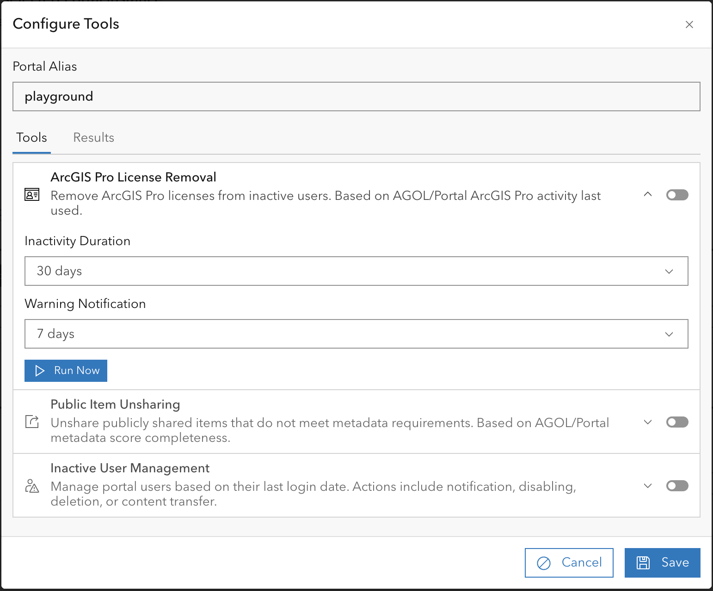

# EnterpriseViz

EnterpriseViz is a tool designed to visualize dependencies between layers, services, web maps, and apps within Esri
Enterprise Portal or ArcGIS Online sites. It helps administrators and developers understand the relationships within
their ArcGIS ecosystem.

## Features

* **Dependency Visualization:** Graphically displays dependencies between layers, services, web maps, and applications.
* **Esri Integration:** Specifically designed for use with Esri Enterprise Portal and ArcGIS Online.
* **Docker Compose Ready:**  Simplified deployment and setup using Docker Compose.

## Layer Tracking and Environment Support

EnterpriseViz provides comprehensive layer tracking with automatic adaptation to different environment types:

### Layer Discovery Methods

EnterpriseViz uses a two-tier approach to discover and track layer information:

1. **Enhanced MSD Parsing (Recommended)**
   - Extracts detailed layer information from ArcGIS Server .msd (Map Service Definition) files
   - Provides **precise layer index tracking** (e.g., distinguishes MapServer/0 from MapServer/5)
   - Determines the exact datasource for each service layer
   - Ideal for Enterprise Portal environments with full .msd file access

2. **Service Manifest Parsing (Automatic Fallback)**
   - Parses layer information from database connection strings in service manifests
   - Automatically activates when MSD parsing is unavailable
   - Fully functional in **disconnected environments** or when .msd files are not available

      **Limitations:**
     - Unable to determine specific layer data sources, only sources at the service level
     - Layer tracking operates at the **layer name level** rather than specific service indices
     - Less precision in distinguishing usage of specific layer indices within the same service
     - Layer detail pages will show all services containing that layers data source

### Finding Layer Usage

The "Find Layer Usage" feature works in both modes:

**With MSD Parsing:**

Result includes usage_type field:
  - "specific_layer": Item uses MapServer/5 specifically
  - "full_service": Item uses entire service (all layers)


**Without MSD Parsing:**

Result includes usage_type field:
* "full_service": Item uses the service (cannot distinguish specific layer)


Both modes successfully identify all maps and applications using your layers.

## Installation

This deployment package is designed for easy setup with Docker Compose. Follow these steps:

1. **Clone the Repository:**

   ```bash
   git clone <repository_url>
   cd <repository_directory>
   ```

2. **Configure Environment Variables:**

   Fill out the various `.env` files according to your environment. Here's a breakdown of the key variables in
   `.env.django`:

    * `REDIS_URL`: URL for the Redis instance (e.g., `redis://redis:6379/0`).
    * `CACHE_URL`: URL for the cache backend (Redis). Use the same host as `REDIS_URL` but a different database index (e.g., `redis://redis:6379/1`).
    * `CREDENTIAL_ENCRYPTION_KEY`: Secret used to encrypt stored portal credentials. Generate a strong random string (32+ characters) and rotate it as needed.
    * `DJANGO_SUPERUSER_USERNAME`: Username for the Django superuser.
    * `DJANGO_SUPERUSER_PASSWORD`: Password for the Django superuser.
    * `DJANGO_SUPERUSER_EMAIL`: Email for the Django superuser
    * `SOCIAL_AUTH_ARCGIS_KEY`: **ArcGIS App ID**. See "Registering an App in ArcGIS Portal/AGOL" below.
    * `SOCIAL_AUTH_ARCGIS_SECRET`: **ArcGIS App Secret**. See "Registering an App in ArcGIS Portal/AGOL" below.
    * `SOCIAL_AUTH_ARCGIS_URL`: The URL of your Enterprise Portal or ArcGIS Online instance (e.g.,
      `https://your_portal.com/portal` or `https://www.arcgis.com`).
    * `ARCGIS_USER_ROLE`: The ArcGIS role required for users to access EnterpriseViz (e.g., `org_admin`).
    * `USE_SERVICE_USAGE_REPORT`: Set to `True` to enable the service usage report feature.
    * `DJANGO_SECRET_KEY`: A randomly generated secret key for your Django application.  **Important:** Keep this
      secret!  You can generate one using Python:

          ```python
          import secrets

          secret_key = secrets.token_urlsafe(32)  # Generates a 43 character URL-safe string
          print(secret_key)
          ```

          Copy the output of this command and paste it into your `.env.django` file.  A new key should be generated for production deployments.

3. **Registering an App in ArcGIS Portal/AGOL:**

   To enable ArcGIS login, you need to register an application within your ArcGIS Portal or ArcGIS Online organization:

    * Sign in to your ArcGIS Portal or ArcGIS Online account as an administrator.
    * Navigate to the "Add Application" section (usually found in the "Content" or "Organization" settings).
    * Register a new application.
    * **Important:** When registering the application, you will be assigned an **App ID** and **App Secret**. These
      values need to be added to the `.env.django` file.
    * **Configure the Redirect URI:**  The redirect URI must be set to the URL of your EnterpriseViz site, plus
      `oauth/complete/arcgis`. For example: `https://your_enterpriseviz_site.com/enterpriseviz/oauth/complete/arcgis`.

## Usage

Once you've configured the `.env` files, you can deploy EnterpriseViz using Docker Compose:

1. **Choose your Deployment Configuration:**

    * For local development, use `local.yml`.
    * For production deployment, use `production.yml`.

2. **Start the Application:**

   ```bash
   # For local development:
   docker-compose up -d

   # For production deployment:
   docker-compose -f docker-compose.prod.yml up -d
   ```

   The `-d` flag runs the containers in detached mode (in the background).

3. **Basic Functionalities:**

   After the containers are running, access EnterpriseViz in your web browser at the appropriate URL (e.g.,
   `http://localhost/enterpriseviz` for local development). The exact URL will depend on your Docker Compose
   configuration.
   Once the application is set up and running, an administrator (Django superuser) can configure portals and manage
   their data. Here's a summary of the key features:

    * **Adding Portals:**

        1. Log into Enterpriseviz as an administrator.
        2. Navigate to the "Manage Menu" in the left-hand menu.
        3. Click "Add Portal".
        4. Fill in the required information:
            * **Name/Alias:** A user-friendly name for the portal.
            * **URL:** The base URL of the ArcGIS Portal or ArcGIS Online instance.
            * **Type:** Select "Enterprise Portal" or "AGOL" from the dropdown.
            * **Store Credentials:** Check this box to store credentials for seamless data refreshes and scheduled
              updates.
              Username and password are encrypted within the database.
              This will allow the application to retrieve data automatically and schedule reoccurring refreshes.
        5. Save the new portal configuration.

    * **Navigating to Portal Pages:**

        1. After adding a portal, a new entry will appear in the "Portals" menu.
        2. Click on the portal's name to navigate to its dedicated page.
        3. The portal page displays tables of web maps, services, layers, apps, and users associated with that portal.

    * **Refreshing Portal Data:**

        1. On the portal page, click the "Refresh" button for each data type in the following order:
            1. Users
            2. Services
            3. Web Maps
            4. Apps
        2. Refreshing the data populates the tables with the latest information from the ArcGIS Portal or ArcGIS Online
           instance.

    * **Managing Portals:**

        1. Navigate to the "Manage Menu" and select the desired portal.
        2. From here, you can:
            * **Delete:** Remove the portal from EnterpriseViz.
            * **Update:** Modify the portal's configuration (name, URL, type, credentials).
            * **Schedule Refreshes:** Set up recurring data refreshes.
                * The schedule window also displays result information from refreshes performed within the past 24
                  hours.
            * **Run Tools:** Access portal management tools (see "Portal Tools" section below).

    * **Details Pages:**

        * **Web Map Details:** Click "Details" on a web map entry to view the contents of that web map.
        * **Service Details:** Click "Details" on a service entry to see:
            * The web maps that contain the service.
            * The apps that contain the service or use the web maps that use the service.
        * **Layer Details:** Click "Details" on a layer entry to view:
            * The services that include the layer (based on layer name).
            * The web maps using those services.
            * The apps using those services or the maps.

    * **Settings**

        * **Logging:** Application logs can be viewed through the Settings panel.
            * Logging levels may be changed here (INFO, WARNING, ERROR, DEBUG, CRITICAL)
            * Log entries include timestamp, level, message, and other contextual information
        * **Email Configuration:** Configure email settings for notifications.
            * SMTP server settings (host, port, encryption type)
            * Authentication credentials
            * Default From and Reply-To addresses
        * **Theme:** Change between light and dark mode.
            * Preferences are saved to your user
        * **Service Usage:** Enable or disable real-time service usage graphs in detail pages.
            * Sometimes usage graphs can take a while to retrieve from ArcGIS Server
        * **Webhooks:** Configure and manage the Webhook Secret used to validate incoming webhook requests for immediate processing of events.
            * The Webhook Secret is required. Set or rotate it using the Webhook Settings modal/form in Settings.
            * Copy this secret into your ArcGIS webhook configuration so EnterpriseViz can verify requests.

    * **Portal Tools**

      EnterpriseViz includes several administrative tools to help manage your ArcGIS Portal.
      Schedule automatic runs or execute on-demand.

        * **ArcGIS Pro License Removal:** Automatically manage ArcGIS Pro licenses.
            * Remove licenses from inactive users based on configurable inactivity duration
            * Send warning notifications before license removal
        * **Inactive User Management:** Manage inactive portal users.
            * Identify users based on configurable inactivity duration
            * Choose actions: notify only, disable user, delete user, or transfer content
            * Send warning notifications before taking action
        * **Public Item Unsharing:** Enforce metadata quality standards.
            * Unshare publicly shared items that don't meet metadata score requirements
            * Configure minimum metadata score threshold (50%, 75%, 90%, 100%)
            * Choose between immediate (webhook) or daily processing

## Limitations

Currently, EnterpriseViz has the following known limitation:

* **App-to-App Dependencies:** Dependencies between applications (e.g., a Map Series containing embedded Web AppBuilder apps, or Hub Sites linking to Dashboards) are not tracked or visualized. The system tracks:
  - App → Service dependencies
  - App → Web Map dependencies
  - Web Map → Service dependencies
  - Service → Layer dependencies
  
  However, relationships where one app directly references or embeds another app are not captured in the dependency graph.

## Changelog

#### December 2025 - Dependency Tracking & Layer Management
* **MSD Parser Implementation** - Extract detailed layer information from .msd files for precise layer index tracking (MapServer/0 vs MapServer/5)
* * **Service Manifest Fallback** - Automatic fallback to service manifest parsing for disconnected environments
* **Layer DataSource Tracking** - Added `service_layer_id` and `webmap_layer_id` fields for precise dependency tracking
* **Enhanced Experience Builder Extraction** - Added layer-level granularity for Experience Builder apps with proper widget type detection (search, filter, table, map)
* **App Type Context** - Enhanced dependency extraction for Web AppBuilder, Instant Apps, Dashboards, StoryMaps with proper context tracking

#### November 2025 - Visualization Improvements
* **New Dependency Graph** - Replaced D3 with Cytoscape.js and Dagre layout for improved visualization
* **Enhanced Layer Details** - Improved layer location display (server, database, version information)
* **Graph Navigation Controls** - Added action bar with zoom, pan, and layout controls
* **App Type Display** - Show specific app item types in dependency graphs

#### October 2025 - Accessibility & Security
* **Comprehensive Accessibility Improvements** - ARIA labels, semantic HTML, keyboard navigation
* **Content Security Policy** - Removed inline styles and `unsafe-eval` requirements
* **Form Accessibility** - Enhanced Calcite form components with proper labeling and validation
* **Table Navigation** - Accessible column sorting and pagination without eval()

#### September 2025 - Webhooks
* **Webhook Integration** - Real-time processing of ArcGIS Portal events
* **Webhook Secret Management** - Secure validation of incoming webhook requests
* **Immediate Event Processing** - Process item updates, sharing changes, and deletions in real-time
* **Public Unshare Automation** - Webhook-triggered enforcement of metadata quality standards

#### August 2025 - Portal Management Tools
* **ArcGIS Pro License Management** - Automated removal from inactive users with configurable grace periods
* **Inactive User Management** - Identify, notify, disable, or delete inactive users with content transfer options
* **Public Item Unsharing** - Enforce metadata score requirements (50%, 75%, 90%, 100% thresholds)
* **Admin Email Notifications** - Configurable email alerts for portal administrators
* **Tool Scheduling** - Schedule automatic runs or execute on-demand

#### June 2025 - Logging & Monitoring
* **Database Logging System** - Comprehensive logging with configurable levels (INFO, WARNING, ERROR, DEBUG, CRITICAL)
* **Log Viewer** - Web interface for viewing and filtering application logs
* **Request Context Tracking** - Enhanced logging with request information and Celery task context
* **Settings Panel** - Centralized configuration for logging, email, theme, and service usage

#### May 2025 - Security & Performance
* **Credential Encryption** - Encrypted storage of portal credentials using configurable encryption keys
* **Credential Manager** - Temporary credential handling with Redis cache
* **Improved Form Validation** - Enhanced schedule and settings form validation
* **Celery Task Improvements** - Parallel processing with configurable concurrency

#### Version 2.0 (April 2025) - Major Architecture Update
* **Docker Compose Deployment** - Simplified deployment with containerization
* **ArcGIS API Update** - Updated to arcgis-python-api 2.x
* **WebMap Processing Refactor** - Using operationalLayers instead of deprecated WebMap class
* **Enhanced Service Tracking** - Improved service and layer relationship tracking
* **Schedule Management** - Configurable recurring data refreshes with cron scheduling

#### Pre-2.0 (2021-2025) - Initial Development
* **Core Functionality** - Initial implementation of dependency visualization
* **Portal Integration** - Support for ArcGIS Enterprise Portal and ArcGIS Online
* **Multi-Item Type Support** - Services, Web Maps, Applications, Layers
* **Basic Refresh** - Manual refresh capabilities for portal data
* **User Authentication** - OAuth integration with ArcGIS Portal/AGOL

---

## Screenshots





## ERD (Entity-Relationship Diagram)


## Credits & Attributions

This project was inspired by **Mapping Item Dependencies Across ArcGIS Enterprise with Python and d3**
by **Seth Lewis, Ayan Mitra, Stephanie Deitrick**
(https://community.esri.com/t5/devsummit-past-user-presentations/mapping-item-dependencies-across-arcgis-enterprise/ta-p/909500)

Data extraction patterns for various ArcGIS application types reference approaches from **Esri's ArcGIS API for Python**
(https://github.com/Esri/arcgis-python-api)
(licensed under the Apache License 2.0).

Portions of this project originally used the Gentelella template by **Giri Bhatnagar**
(https://github.com/GiriB/django-gentelella)
(licensed under the MIT License). Modifications have been made.

**Original License:**
The MIT License (MIT)

Copyright (c) 2018 Giri Bhatnagar

Permission is hereby granted, free of charge, to any person obtaining a copy
of this software and associated documentation files (the "Software"), to deal
in the Software without restriction, including without limitation the rights
to use, copy, modify, merge, publish, distribute, sublicense, and/or sell
copies of the Software, and to permit persons to whom the Software is
furnished to do so, subject to the following conditions:

The above copyright notice and this permission notice shall be included in
all copies or substantial portions of the Software.

THE SOFTWARE IS PROVIDED "AS IS", WITHOUT WARRANTY OF ANY KIND, EXPRESS OR
IMPLIED, INCLUDING BUT NOT LIMITED TO THE WARRANTIES OF MERCHANTABILITY,
FITNESS FOR A PARTICULAR PURPOSE AND NONINFRINGEMENT. IN NO EVENT SHALL THE
AUTHORS OR COPYRIGHT HOLDERS BE LIABLE FOR ANY CLAIM, DAMAGES OR OTHER
LIABILITY, WHETHER IN AN ACTION OF CONTRACT, TORT OR OTHERWISE, ARISING FROM,
OUT OF OR IN CONNECTION WITH THE SOFTWARE OR THE USE OR OTHER DEALINGS IN
THE SOFTWARE.

## License

This project is licensed under the **MIT License**.

You are free to use, modify, and distribute this software under the terms of the MIT License. See the [LICENSE](LICENSE)
file for details.

