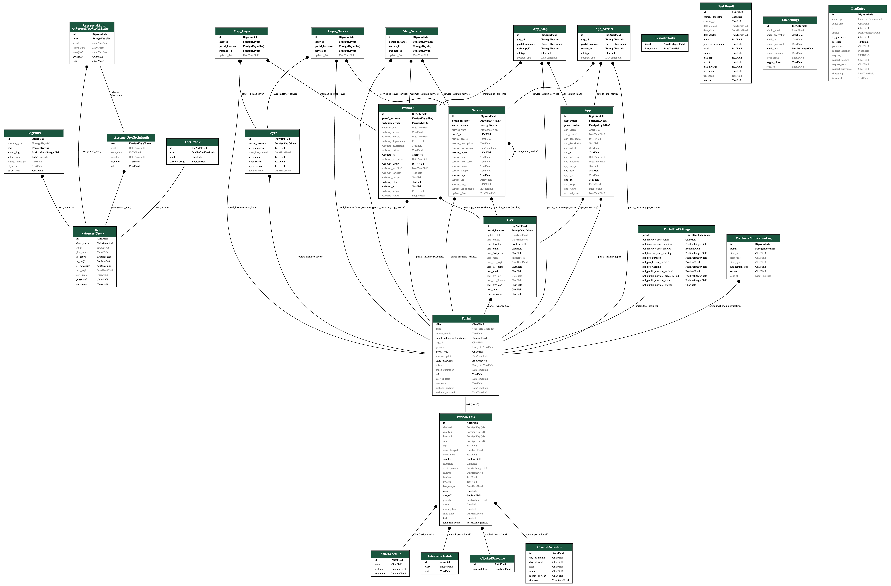

# EnterpriseViz

EnterpriseViz is a tool designed to visualize dependencies between layers, services, web maps, and apps within Esri Enterprise Portal or ArcGIS Online sites. It helps administrators and developers understand the relationships within their ArcGIS ecosystem.

## Features

*   **Dependency Visualization:** Graphically displays dependencies between layers, services, web maps, and applications.
*   **Esri Integration:** Specifically designed for use with Esri Enterprise Portal and ArcGIS Online.
*   **Docker Compose Ready:**  Simplified deployment and setup using Docker Compose.

## Installation

This deployment package is designed for easy setup with Docker Compose.  Follow these steps:

1.  **Clone the Repository:**

    ```bash
    git clone <repository_url>
    cd <repository_directory>
    ```

2.  **Configure Environment Variables:**

    Fill out the various `.env` files according to your environment.  Here's a breakdown of the key variables in `.env.django`:

    *   `REDIS_URL`: URL for the Redis instance (e.g., `redis://redis:6379/0`).
    *   `DJANGO_SUPERUSER_USERNAME`: Username for the Django superuser.
    *   `DJANGO_SUPERUSER_PASSWORD`: Password for the Django superuser.
    *   `DJANGO_SUPERUSER_EMAIL`: Email for the Django superuser
    *   `SOCIAL_AUTH_ARCGIS_KEY`: **ArcGIS App ID**. See "Registering an App in ArcGIS Portal/AGOL" below.
    *   `SOCIAL_AUTH_ARCGIS_SECRET`: **ArcGIS App Secret**. See "Registering an App in ArcGIS Portal/AGOL" below.
    *   `SOCIAL_AUTH_ARCGIS_URL`: The URL of your Enterprise Portal or ArcGIS Online instance (e.g., `https://your_portal.com/portal` or `https://www.arcgis.com`).
    *   `ARCGIS_USER_ROLE`: The ArcGIS role required for users to access EnterpriseViz (e.g., `org_admin`).
    *   `USE_SERVICE_USAGE_REPORT`: Set to `True` to enable the service usage report feature.
    *   `DJANGO_SECRET_KEY`: A randomly generated secret key for your Django application.  **Important:** Keep this secret!  You can generate one using Python:

            ```python
            import secrets

            secret_key = secrets.token_urlsafe(32)  # Generates a 43 character URL-safe string
            print(secret_key)
            ```

            Copy the output of this command and paste it into your `.env.django` file.  A new key should be generated for production deployments.

3.  **Registering an App in ArcGIS Portal/AGOL:**

    To enable ArcGIS login, you need to register an application within your ArcGIS Portal or ArcGIS Online organization:

    *   Sign in to your ArcGIS Portal or ArcGIS Online account as an administrator.
    *   Navigate to the "Add Application" section (usually found in the "Content" or "Organization" settings).
    *   Register a new application.
    *   **Important:** When registering the application, you will be assigned an **App ID** and **App Secret**. These values need to be added to the `.env.django` file.
    *   **Configure the Redirect URI:**  The redirect URI must be set to the URL of your EnterpriseViz site, plus `oauth/complete/arcgis`. For example: `https://your_enterpriseviz_site.com/enterpriseviz/oauth/complete/arcgis`.

## Usage

Once you've configured the `.env` files, you can deploy EnterpriseViz using Docker Compose:

1.  **Choose your Deployment Configuration:**

    *   For local development, use `local.yml`.
    *   For production deployment, use `production.yml`.

2.  **Start the Application:**

    ```bash
    # For local development:
    docker-compose up -d

    # For production deployment:
    docker-compose -f docker-compose.prod.yml up -d
    ```

    The `-d` flag runs the containers in detached mode (in the background).

3.  **Basic Functionalities:**

    After the containers are running, access EnterpriseViz in your web browser at the appropriate URL (e.g., `http://localhost/enterpriseviz` for local development).  The exact URL will depend on your Docker Compose configuration.
    Once the application is set up and running, an administrator (Django superuser) can configure portals and manage their data. Here's a summary of the key features:

    *   **Adding Portals:**

        1.  Log in to the Django admin interface as a superuser.
        2.  Navigate to the "Manage Menu" in the left-hand menu.
        3.  Click "Add Portal".
        4.  Fill in the required information:
            *   **Name/Alias:** A user-friendly name for the portal.
            *   **URL:** The base URL of the ArcGIS Portal or ArcGIS Online instance.
            *   **Type:** Select "Enterprise Portal" or "AGOL" from the dropdown.
            *   **Store Credentials:** Check this box to store credentials for seamless data refreshes and scheduled updates.
            Username and password are encrypted within the database.
            This will allow the application to retrieve data automatically and schedule reoccurring refreshes.
        5.  Save the new portal configuration.

    *   **Navigating to Portal Pages:**

        1.  After adding a portal, a new entry will appear in the "Portals" menu.
        2.  Click on the portal's name to navigate to its dedicated page.
        3.  The portal page displays tables of web maps, services, layers, apps, and users associated with that portal.

    *   **Refreshing Portal Data:**

        1.  On the portal page, click the "Refresh" button for each data type in the following order:
            1.  Users
            2.  Services
            3.  Web Maps
            4.  Apps
        2.  Refreshing the data populates the tables with the latest information from the ArcGIS Portal or ArcGIS Online instance.

    *   **Managing Portals:**

        1.  Navigate to the "Manage Menu" and select the desired portal.
        2.  From here, you can:
            *   **Delete:** Remove the portal from EnterpriseViz.
            *   **Update:** Modify the portal's configuration (name, URL, type, credentials).
            *   **Schedule Refreshes:** Set up recurring data refreshes.
                *   The schedule window also displays result information from refreshes performed within the past 24 hours.

    *   **Details Pages:**

        *   **Web Map Details:** Click "Details" on a web map entry to view the contents of that web map.
        *   **Service Details:** Click "Details" on a service entry to see:
            *   The web maps that contain the service.
            *   The apps that contain the service or use the web maps that use the service.
        *   **Layer Details:** Click "Details" on a layer entry to view:
            *   The services that include the layer (based on layer name).
            *   The web maps using those services.
            *   The apps using those services or the maps.


## Screenshots


## ERD (Entity-Relationship Diagram)




## Credits & Attributions
This project was inspired by **Mapping Item Dependencies Across ArcGIS Enterprise with Python and d3
** by **Seth Lewis, Ayan Mitra, Stephanie Deitrick**
(https://community.esri.com/t5/devsummit-past-user-presentations/mapping-item-dependencies-across-arcgis-enterprise/ta-p/909500)

D3 collapsible tree graph used from **D3.js Drag and Drop, Zoomable, Panning, Collapsible Tree with auto-sizing.**
by **Rob Schmuecker** (https://gist.github.com/robschmuecker/7880033)

Finding unused services based on **gis-administration** by **Joshua Sharp Heward**
(https://github.com/joshsharpheward/gis-administration)

**Original License**
(C) 2019 Joshua Sharp-Heward, Whangarei, New Zealand
released under GNU Lesser Public License v3.0 (GPLv3)
email jsh726@uowmail.edu.au
linkedin https://www.linkedin.com/in/joshua-sharp-heward-89b129131/

Portions of this project originally used a template by **Aigars Silkalns & Colorlib**
(licensed under the MIT License). Modifications have been made.

**Original License:**
The MIT License (MIT)

Copyright (c) 2016 Aigars Silkalns & Colorlib

Permission is hereby granted, free of charge, to any person obtaining a copy
of this software and associated documentation files (the "Software"), to deal
in the Software without restriction, including without limitation the rights
to use, copy, modify, merge, publish, distribute, sublicense, and/or sell
copies of the Software, and to permit persons to whom the Software is
furnished to do so, subject to the following conditions:

The above copyright notice and this permission notice shall be included in
all copies or substantial portions of the Software.

THE SOFTWARE IS PROVIDED "AS IS", WITHOUT WARRANTY OF ANY KIND, EXPRESS OR
IMPLIED, INCLUDING BUT NOT LIMITED TO THE WARRANTIES OF MERCHANTABILITY,
FITNESS FOR A PARTICULAR PURPOSE AND NONINFRINGEMENT. IN NO EVENT SHALL THE
AUTHORS OR COPYRIGHT HOLDERS BE LIABLE FOR ANY CLAIM, DAMAGES OR OTHER
LIABILITY, WHETHER IN AN ACTION OF CONTRACT, TORT OR OTHERWISE, ARISING FROM,
OUT OF OR IN CONNECTION WITH THE SOFTWARE OR THE USE OR OTHER DEALINGS IN
THE SOFTWARE.

## License
This project is licensed under the GNU General Public License v3.0 - see the [LICENSE](LICENSE) file for details.

